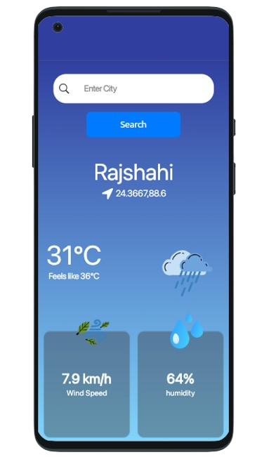
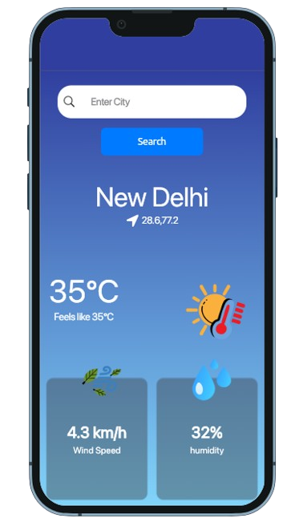

# CloudMate ☁️

CloudMate is a sleek and user-friendly weather app built using **Flutter** with **GetX** for state management. It provides weather updates such as temperature, wind speed, and humidity. The app is designed to be responsive for both small and large screens and uses a free Weather API to fetch real-time weather data.

## Features 🌟
- Search for weather updates by city.
- Displays current temperature, wind speed, and humidity levels.
- Fully responsive UI for both small and large screens.
- Built with **CupertinoApp** for a clean and consistent iOS-style design.
- Powered by **GetX** for efficient state management.
- Fetches weather data using a free Weather API.

## Screenshots 📸
Below are some screenshots showcasing the app's interface:

  
  

